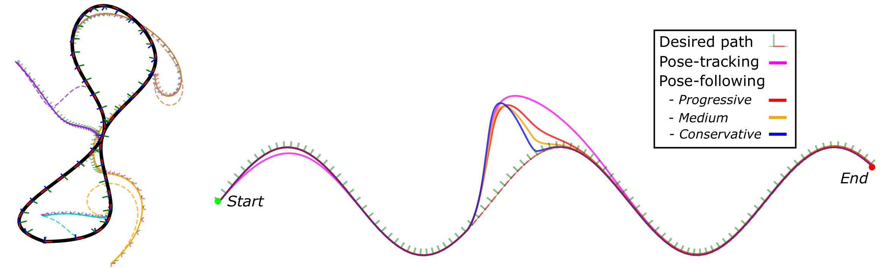

# PFDQ: Pose-Following with Dual Quaternions

A pose-following framework based on unit dual quaternions for simultaneously controlling the translation and rotation of a rigid body.

For the implementation details, please check the [paper](https://arxiv.org/pdf/2308.09507.pdf) and/or watch the [video](https://youtu.be/TQig2j90Ijc?si=7fzd7vuAhxWUonxs). If you use this framework please cite our work:

```
@inproceedings{arrizabalaga2023pose,
  title={Pose-Following with Dual Quaternions},
  author={Arrizabalaga, Jon and Ryll, Markus},
  booktitle={2023 62nd IEEE Conference on Decision and Control (CDC)},
  pages={5959--5966},
  year={2023},
  organization={IEEE}
}
```

## Requirements

### Python environment

Install the specific versions of every package from `requirements.txt`.
In a new conda environment:

```
conda create --name pfdq python=3.9
conda activate pfdq
pip install -r requirements.txt
```

Update the `~/.bashrc` with

```
export PFDQ_PATH=/path_to_pfdq
export PYTHONPATH=$PYTHONPATH:/$PFDQ_PATH
```

## Usage

### Replicating the experiments

To replicate the two case studies of the paper, run [this file](pose_following.py). For example, to run experiment 2 with the conservative velocity profile, run:

```bash
python pose_following.py --case_study 1 --velocity_profile c
```

And if you want to compare it to the path tracking solution, run:

```bash
python pose_following.py --case_study 1 --pt
```

Similarly, to run experiment 1 from the 1st starting point:

```bash
python pose_following.py --case_study 2 --starting_point 1
```

The options are the following ones:

- `--case_study`: `1` (experiment 2) or `2` (experiment 1).
- `--pt`: Enables `path-tracking` instead of `path-following`.
- `--velocity_profile`, only for path-following (without --pt):
  - Case study 1: `c` (conservative), `m` (medium), `p` (progressive).
  - Case study 2: `s` (slow), `f` (fast), `v` (variant) for case study 2.
- `--starting_point`, only for case_study 2 : `0`,`1`,`2`,`3`,`4`,`5`.
- `--save`: Saves the results in the `pfdq/results/data` folder. It is recommended not to trigger this, since you will overwrite the results of the paper.

### Visualizing the results

If you run the case studies as mentioned above and save the respective results, you can generate the same plots as in the paper:

1. **Case study 1 - Comparison to pose-tracking**: Run [this file](pfdq/results/case_study1_results.py).

2. **Case study2 - Almost global asymptotic stability on pose-following with velocity assignment**: For the first column, run [this file](pfdq/results/case_study2_col1_results.py) and, for the second column [this other file](pfdq/results/case_study2_col2_results.py).

### Additional material

We also provide an [additional script](pose_tracking.py) that replicates the results from the pose-tracking paper: _Unit dual quaternion-based feedback linearization tracking problem for attitude and position dynamics, X.Wang and C.Yu, Systems &Control Letters, 2013_
